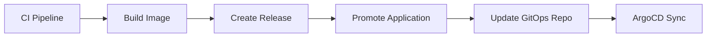

# Application Deployment
Keywords: deploy, promote, gitops, environment, elastisys, ocp, openshift

## GitOps Deployment Model

Deployments are managed via the `agronod/application-gitops` repository. The promotion workflow updates image tags in YAML files.



## Environment Mapping

| Branch | Environment | Cluster |
|--------|-------------|---------|
| `develop` | dev | dev |
| `release` | test | dev |
| `main` | staging | prod |
| (manual) | production | prod |

## Promotion Workflow

```yaml
uses: ./.github/workflows/promote-application.yml
with:
  tag: ${{ needs.build-and-push-image.outputs.tag }}
  application-name: "my-app"
  application-folder: "deployments/my-app"
  image-tag-parameter: "image.tag"  # Optional
  environment: ""  # Optional override
secrets:
  github-token: ${{ secrets.github-token }}
```

## GitOps File Structure

```
application-gitops/
├── dev-elastisys/
│   ├── dev/
│   │   └── {application-folder}/{application-name}.yaml
│   └── test/
│       └── {application-folder}/{application-name}.yaml
└── prod-elastisys/
    ├── staging/
    │   └── {application-folder}/{application-name}.yaml
    └── production/
        └── {application-folder}/{application-name}.yaml
```

## YAML Update Pattern

Uses JSONPath to update Helm parameter values:

```yaml
- name: Promote to Elastisys
  uses: fjogeleit/yaml-update-action@main
  with:
    valueFile: ${{ cluster }}-elastisys/${{ env }}/${{ folder }}/${{ name }}.yaml
    propertyPath: "$.spec.source.helm.parameters[?(@.name=='image.tag')].value"
    value: ${{ inputs.tag }}
    commitChange: false
```

## Conventions

- Environment is derived from branch unless explicitly overridden
- Commit message format: `Bump {application-name}:{tag}`
- Platform default is `elastisys` (OCP deprecated)

## Rules

- MUST: Include `application-name` and `application-folder` for promotions
- MUST: Use GitHub token with write access to `application-gitops`
- PREFER: Let workflow derive environment from branch
- AVOID: Manual environment overrides except for production

## References

- Key files: `.github/workflows/promote-application.yml`
- External: `agronod/application-gitops` repository
- Related contexts: `../../versioning/overview/context.md`
