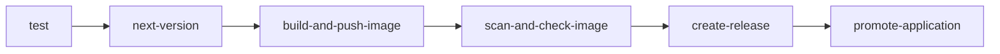

# CI Pipeline Workflows
Keywords: ci, pipeline, test, build, release, node, python, dotnet, go, language

## Architecture

Language-specific CI workflows compose shared infrastructure workflows in a standard job dependency chain:



## Supported Languages

| Language | CI Workflow | Test Workflow | Default Version |
|----------|-------------|---------------|-----------------|
| Node.js | `node-ci.yml` | `node-test.yml` | 20.15.0 |
| Python | `python-ci.yml` | `python-test.yml` | 3.10 |
| .NET | `dotnet-ci.yml` | `dotnet-test.yml` | (required) |
| Go | `go-ci.yml` | `go-test.yml` | 1.21 |

## Standard CI Workflow Structure

```yaml
name: {Language} CI

on:
  workflow_call:
    inputs:
      {language}-version:
        default: "{default-version}"
        type: string
      application-name:
        required: true
        type: string
      application-folder:
        required: true
        type: string
      test:
        default: true
        type: boolean
    secrets:
      github-user:
        required: true
      github-token:
        required: true
      registry-username:
        required: true
      registry-password:
        required: true

jobs:
  test:
    uses: ./.github/workflows/{language}-test.yml
  next-version:
    needs: "test"
    uses: ./.github/workflows/next-version.yaml
  build-and-push-image:
    needs: "next-version"
    uses: ./.github/workflows/build-and-push-image.yml
  create-release:
    needs: ["build-and-push-image", "next-version"]
    uses: ./.github/workflows/create-release.yml
  promote-application:
    needs: ["create-release", "build-and-push-image"]
    uses: ./.github/workflows/promote-application.yml
```

## Conventions

- All workflows use `workflow_call` trigger for reusability
- Job names use `kebab-case`
- Input names use `kebab-case`
- Version numbers must be quoted: `"20.15.0"`

## Rules

- MUST: Follow the standard job dependency chain
- MUST: Pass secrets through explicit `secrets:` block
- MUST: Include `github-token` secret for all workflows
- PREFER: Use existing infrastructure workflows over custom implementations
- AVOID: Hardcoded version numbers - use inputs with defaults

## References

- Key files: `.github/workflows/node-ci.yml`, `.github/workflows/python-ci.yml`
- Related contexts: `../pr-validation/context.md`, `../../versioning/overview/context.md`
