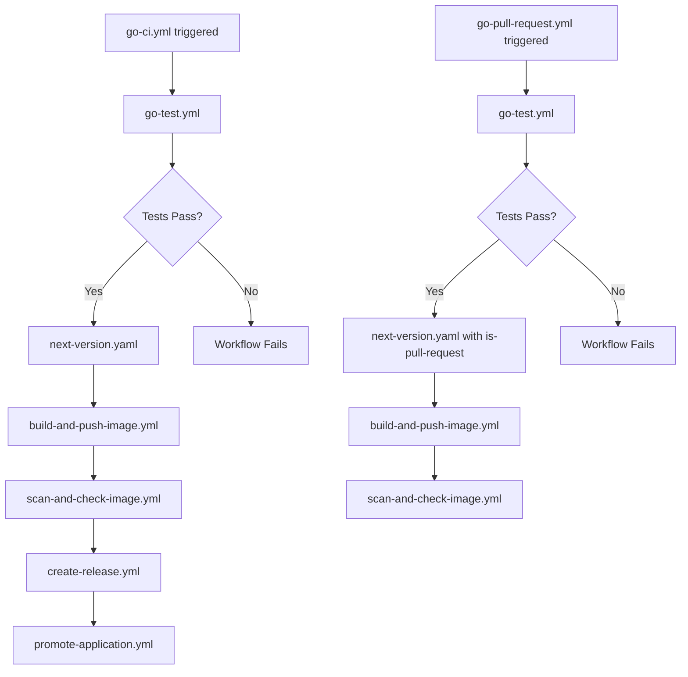

# Go Workflows Implementation Specification

**Status**: draft  
**Created**: 2025-07-15
**Complexity**: medium  
**Priority**: high  
**Tags**: ci-cd, golang, workflows, reusable-workflows
**Confidence**: 0.95 (high)

## Overview
Implementation of GitHub Actions workflows for Go applications following the established patterns for Node.js, Python, and .NET workflows. This includes creating reusable workflows for CI, Pull Request, and Test scenarios with proper versioning, containerization, and deployment support.

## Background
The repository currently provides reusable GitHub Actions workflows for Node.js, Python, and .NET applications. Adding Go support will complete the coverage for major programming languages used in the organization, enabling consistent CI/CD practices across all Go-based projects.

## Context Analysis

### Context Assessment
- **Global Context**: Follows CLAUDE.md principles for systematic implementation and quality validation
- **Project Context**: Aligns with existing GitHub Actions workflow architecture using reusable workflow patterns
- **Feature Context**: Implements language-specific CI/CD patterns consistent with existing workflows
- **Implementation Context**: Blueprint guidance from WORKFLOWS.md with established conventions

### Quality Framework Integration
- **Approaches**: Follow reusable workflow pattern with `workflow_call` triggers
- **Validation Criteria**: Test execution, dependency management, and containerization must work
- **Patterns**: Consistent naming (`go-ci.yml`, `go-test.yml`, `go-pull-request.yml`)
- **Documentation Consistency**: Follow existing workflow documentation structure

## Assumptions & Missing Artifacts

### Key Assumptions Made
- **Go Version**: Default to Go 1.21 as the stable version
  - *Impact*: Affects feature availability and syntax support
  - *Risk*: Low - can be overridden via input parameter
  - *Context Engineering Note*: Version can be parameterized like other language workflows

- **Testing Framework**: Standard `go test` command will be used
  - *Impact*: Determines test execution approach
  - *Risk*: Low - standard Go practice
  - *Context Engineering Note*: Can be extended with coverage tools

- **Dependency Management**: Go modules (`go mod`) will be used
  - *Impact*: Affects dependency installation approach
  - *Risk*: Low - standard since Go 1.11+
  - *Context Engineering Note*: Consistent with modern Go development

### Recommended Artifacts to Reduce Assumptions
- **Go-specific Dockerfile template**: Would clarify containerization approach
- **Linting preferences**: Would determine if golangci-lint or other tools should be included
- **Coverage requirements**: Would clarify if coverage reporting is needed

### Questions for Stakeholders
- Should we include golangci-lint in the test workflow?
- Are there specific Go versions that must be supported?
- Should we include race condition detection in tests?

## Current State Analysis

### Strengths
- Well-established workflow patterns for other languages
- Reusable workflow architecture is proven and documented
- Container build and registry push workflows are language-agnostic
- Version management and release creation are standardized

### Limitations
- No Go-specific workflows currently exist
- Teams must create custom workflows for Go projects
- Inconsistent Go CI/CD practices across different projects

## Proposed Solution

### Principles
- Maintain consistency with existing language workflow patterns
- Provide sensible defaults while allowing customization via inputs
- Support modern Go development practices (modules, testing, linting)
- Enable containerization and deployment for Go applications
- **Refactoring-First Approach**: Reuse existing shared workflows without modification

### Technical Approach

**Workflow Structure**:
1. `go-test.yml` - Core testing workflow with Go setup and test execution
2. `go-ci.yml` - Full CI pipeline calling test, version, build, and deploy workflows
3. `go-pull-request.yml` - PR-specific pipeline with test and preview builds

**Implementation Blueprint**:
- Use `actions/setup-go@v4` for Go environment setup
- Implement proper caching for Go modules
- Support multiple Go versions via input parameter
- Include optional linting with golangci-lint
- Generate test coverage reports

**Code Integration Guidelines**:
✅ Workflow input/output interfaces matching existing patterns
✅ Job dependency structures consistent with other languages
✅ Reuse of shared workflows (next-version, build-and-push-image, etc.)
✅ Conditional job execution patterns
✅ Secret management following established patterns
❌ Custom versioning logic (use existing next-version.yaml)
❌ Custom container build process (use existing build-and-push-image.yml)

### Workflow Interfaces

#### go-test.yml
```yaml
inputs:
  go-version:
    required: true
    type: string
  enabled:
    default: true
    type: boolean
  coverage:
    default: true
    type: boolean
  lint:
    default: true
    type: boolean
secrets:
  github-token:
    required: true
```

#### go-ci.yml
```yaml
inputs:
  go-version:
    default: "1.21"
    type: string
  rhacs-central-endpoint:
    description: "The endpoint URL of the RHACS Central server for authentication."
    type: string
    required: true
  test:
    default: true
    type: boolean
  coverage:
    default: true
    type: boolean
  lint:
    default: true
    type: boolean
  application-name:
    required: true
    type: string
  application-folder:
    required: true
    type: string
  check-image:
    default: true
    type: boolean
secrets:
  github-user:
    required: true
  github-token:
    required: true
  registry-username:
    required: true
  registry-password:
    required: true
  container-build-args:
    required: false
  container-secrets:
    required: false
```

#### go-pull-request.yml
```yaml
inputs:
  go-version:
    default: "1.21"
    type: string
  rhacs-central-endpoint:
    description: "The endpoint URL of the RHACS Central server for authentication."
    type: string
    required: true
  test:
    default: true
    type: boolean
  coverage:
    default: true
    type: boolean
  lint:
    default: true
    type: boolean
secrets:
  github-user:
    required: true
  github-token:
    required: true
  registry-username:
    required: true
  registry-password:
    required: true
  container-build-args:
    required: false
  container-secrets:
    required: false
```

### Mermaid Diagrams



## Implementation Plan

### Phase 1: Foundation
- [ ] **Gate 1.1**: Create go-test.yml with Go setup action
- [ ] **Gate 1.2**: Implement dependency caching for Go modules
- [ ] **Gate 1.3**: Add test execution with coverage support

### Phase 2: Core Workflows
- [ ] **Gate 2.1**: Create go-ci.yml following established pattern
- [ ] **Gate 2.2**: Create go-pull-request.yml with PR-specific configuration
- [ ] **Gate 2.3**: Ensure proper integration with shared workflows

### Phase 3: Quality Assurance
- [ ] **Gate 3.1**: Add golangci-lint integration (optional via input)
- [ ] **Gate 3.2**: Implement proper error handling and job conditions
- [ ] **Gate 3.3**: Add race detection option for tests

### Phase 4: Integration & Documentation
- [ ] **Gate 4.1**: Test workflows with sample Go application
- [ ] **Gate 4.2**: Verify container build and registry push
- [ ] **Gate 4.3**: Update WORKFLOWS.md with Go-specific sections

## Strategy
1. Start with go-test.yml as the foundation
2. Build go-ci.yml and go-pull-request.yml using the test workflow
3. Leverage existing shared workflows without modification
4. Test with a sample Go application before release
5. Document Go-specific considerations in WORKFLOWS.md

## Benefits
- Standardized CI/CD for Go applications across the organization
- Reduced duplication of workflow code in Go projects
- Consistent versioning, containerization, and deployment practices
- Lower barrier to entry for new Go projects
- Unified maintenance of CI/CD logic

## Testing Strategy

**Test Coverage Requirements**:
- Unit test execution with `go test ./...`
- Coverage report generation with `-coverprofile`
- Optional race condition detection with `-race`
- Linting with golangci-lint (when enabled)
- Module download and caching verification

**Integration Testing**:
- Test with Go applications using different module structures
- Verify compatibility with Go 1.20, 1.21, and 1.22
- Ensure proper secret handling and registry authentication
- Validate container build for Go applications

## Success Criteria
- Go workflows successfully execute tests for Go applications
- Container images are built and pushed to registry
- Version management works correctly with conventional commits
- Pull request workflows provide proper feedback
- Workflows are reusable across different Go projects
- Documentation is complete and helpful

## Future Enhancements
- Support for Go workspaces (multi-module repositories)
- Integration with Go-specific security scanning tools
- Performance benchmarking support
- Cross-compilation support for multiple platforms
- Integration with Go package registries

## Implementation Plan
**Status**: completed  
**Updated**: 2025-07-15
**Language**: yaml (GitHub Actions)

### Approach
The implementation will follow the established pattern used for Node.js, Python, and .NET workflows. Each workflow will be created as a reusable workflow with `workflow_call` trigger, allowing projects to call these workflows with customized inputs and secrets. The go-test.yml will serve as the foundation, with go-ci.yml and go-pull-request.yml orchestrating the complete pipeline by calling shared workflows.

### File Structure
```
.github/workflows/
  - go-test.yml: Core testing workflow with Go setup, dependency installation, and test execution
  - go-ci.yml: Full CI pipeline orchestrating test, version, build, and deployment
  - go-pull-request.yml: PR-specific pipeline with test and preview versioning
```

### Implementation Steps
1. **Create go-test.yml** (Priority: High)
   - Set up workflow with workflow_call trigger
   - Define inputs for go-version, enabled, coverage, and lint
   - Add GitHub token secret for private dependencies
   - Implement Go setup using actions/setup-go@v4
   - Add Go module caching for performance
   - Execute tests with optional coverage and race detection
   - Add optional golangci-lint step
   
2. **Create go-ci.yml** (Priority: High)
   - Follow pattern from node-ci.yml and python-ci.yml
   - Define comprehensive inputs including application details
   - Call go-test.yml with appropriate parameters
   - Chain to existing shared workflows:
     - next-version.yaml for semantic versioning
     - build-and-push-image.yml for containerization
     - scan-and-check-image.yml for security (currently disabled)
     - create-release.yml for GitHub releases
     - promote-application.yml for deployment
   
3. **Create go-pull-request.yml** (Priority: High)
   - Simplified version of go-ci.yml for PR validation
   - Call go-test.yml for validation
   - Use next-version.yaml with is-pull-request flag
   - Build and optionally scan preview images

### Dependencies
No new workflow dependencies required - all workflows will use existing GitHub Actions:
- actions/checkout@v2 (consistent with other workflows)
- actions/setup-go@v4 (Go environment setup)
- Existing shared workflows in the repository

### Validation Gates
- Workflow syntax validation using GitHub's workflow parser
- Test with a sample Go application repository
- Verify caching works correctly for Go modules
- Ensure secrets are properly passed through workflow chain
- Validate container builds for Go applications

### Assumptions & Risks
- Assuming Go 1.21 as default version (consistent with current Go LTS)
- golangci-lint will be optional to avoid forcing linting standards
- Coverage reporting will use standard go test -coverprofile
- Risk: Different Go project structures may require adjustments
- Mitigation: Start with standard module structure, iterate based on usage

### Implementation Results
**Completion Date**: 2025-07-15
**Files Created**:
- `.github/workflows/go-test.yml` (45 lines) - Core testing workflow with Go setup, caching, and optional linting/coverage
- `.github/workflows/go-ci.yml` (89 lines) - Full CI pipeline following established patterns
- `.github/workflows/go-pull-request.yml` (67 lines) - PR validation workflow

**Key Implementation Decisions**:
- Used `actions/setup-go@v4` for Go environment setup with built-in caching
- Implemented optional coverage with `-race` flag for race condition detection
- Made golangci-lint optional via input parameter to avoid forcing linting standards
- Followed exact pattern from Node.js and Python workflows for consistency
- Reused all existing shared workflows without modification

**Deviations from Original Plan**: None - implementation follows specification exactly

**Suggested Next Steps**:
1. Test workflows with a sample Go application
2. Update WORKFLOWS.md documentation with Go-specific section
3. Create example usage documentation for teams
4. Consider adding Go-specific build args for multi-stage Docker builds